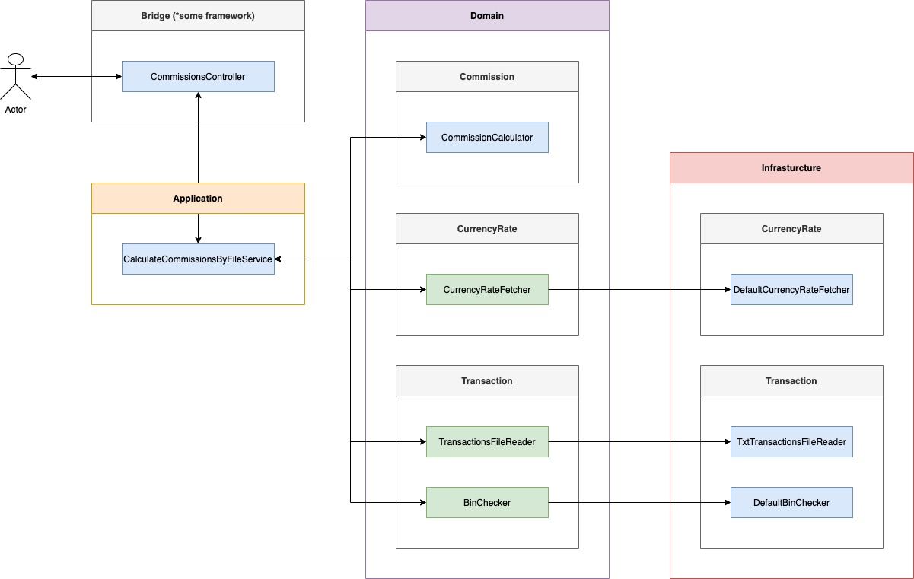

# Commission calculator task

## Project setup
- create .env and define your exchange rates API token
- ```composer install```
- ```php vendor/bin/phpunit tests/unit```
- ```php bin/console.php input.txt```

Notes:
- For Application and Domain layers unit tests were added.
- For infrastructure layer unit tests could be also added, but it's not done due to their simplicity.
- There is no *good code* in Bridge layer, because it's out of scope of this project (only fake DI, routing etc.). For example, Bridge can be changed to use Symfony framework (like bundle or just simple services).
- Also there a lot of other things been ignored like logging, better exception catching, resolvers etc.

## Design
